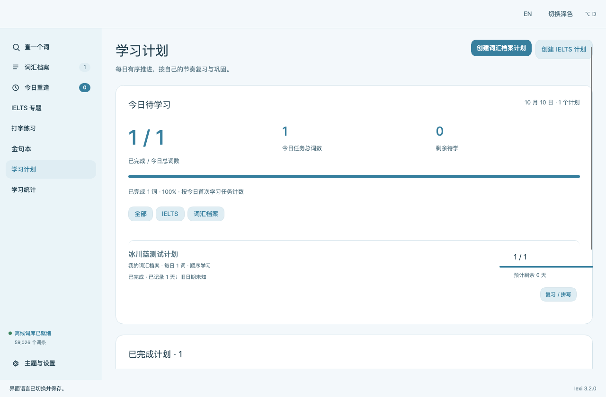
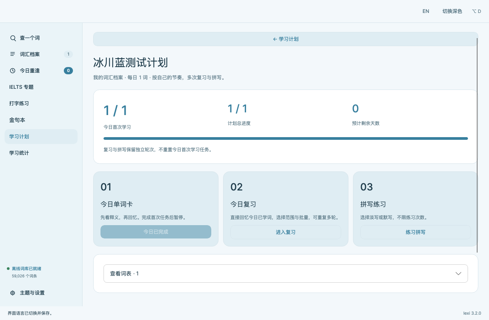
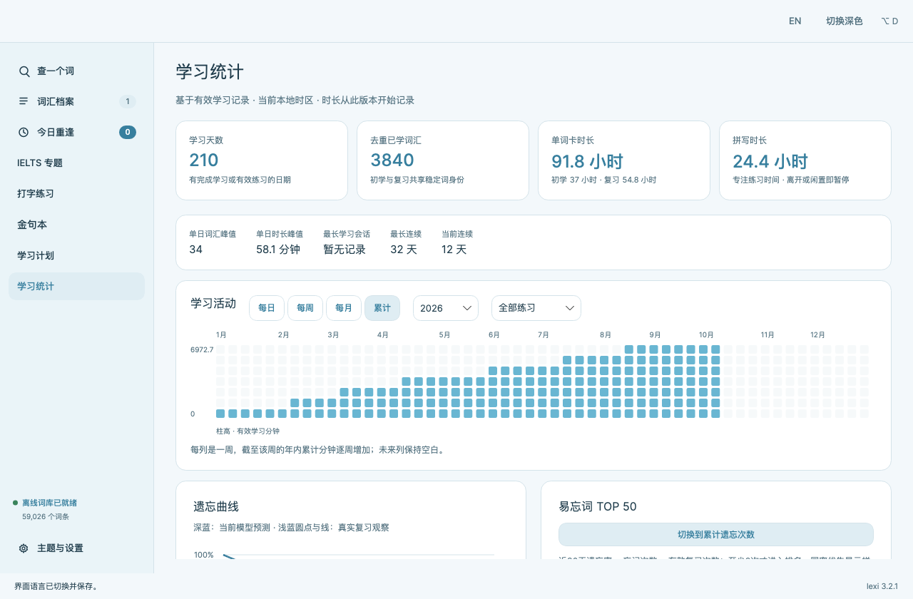
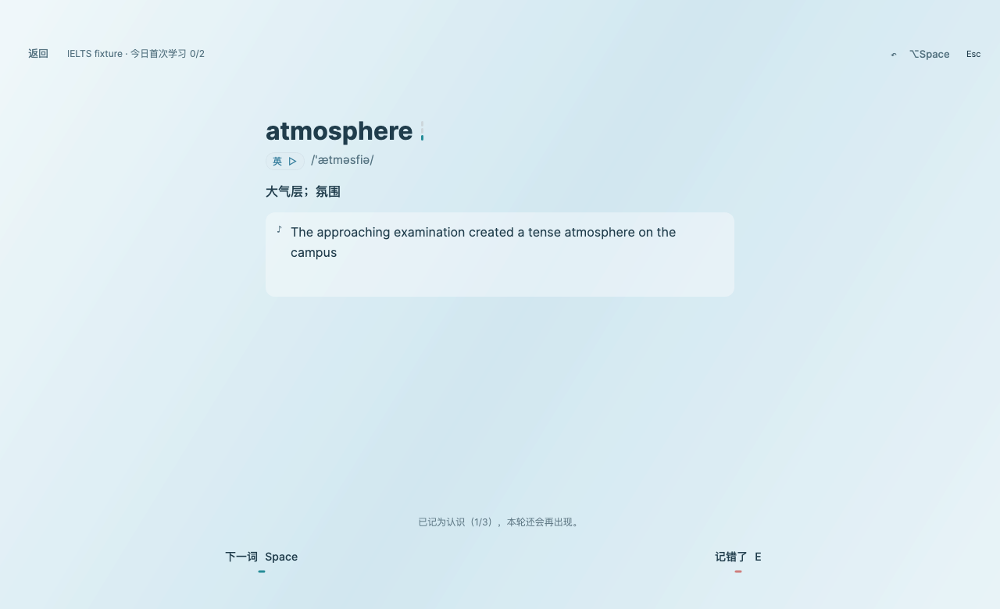
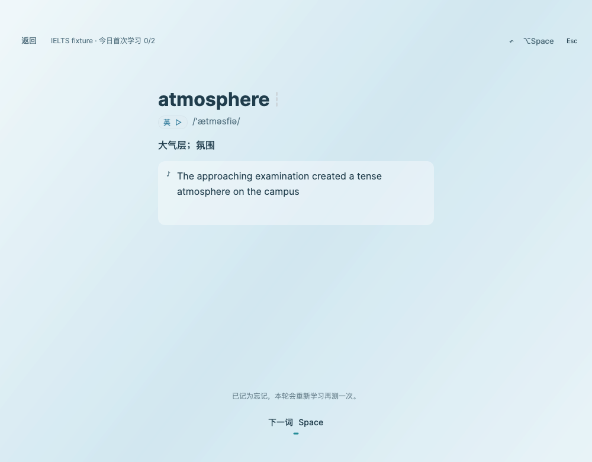
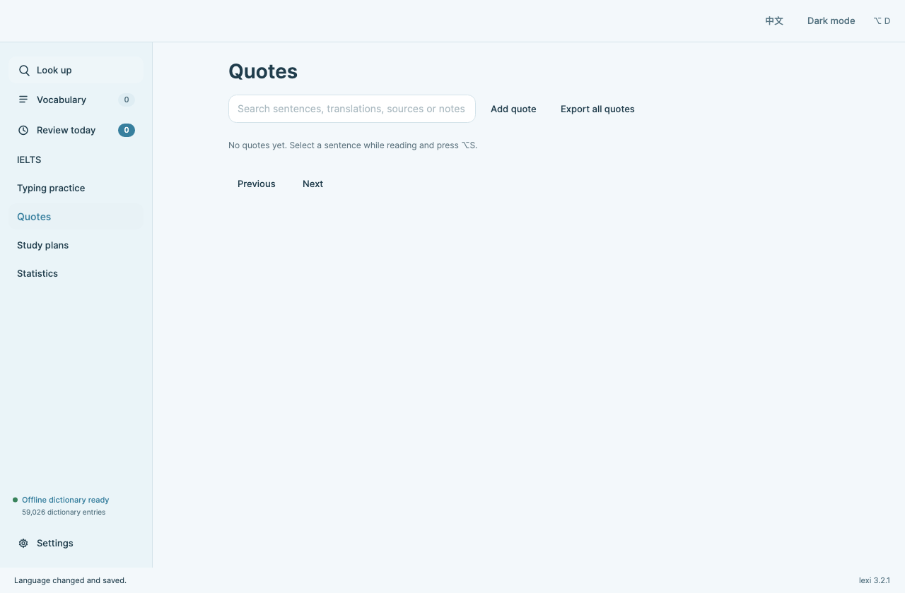

<div align="center">

# Lexi · 把阅读中的生词，变成自己的长期记忆

**macOS 英语学习应用 · 流畅的小卡片交互 · 冰川蓝界面 · 本机个性化记忆系统**

[下载与版本记录](https://github.com/DespairJasper/lexi-macos/releases) · [使用与安装](#安装与开始使用) · [记忆系统](#复习逐渐适应你的记忆) · [源码构建](#从源码构建)

Apple Silicon · macOS 12+ · 中英文界面 · 离线词典

</div>

---

Lexi 把查词、阅读摘录、词汇整理和日常学习放在同一个应用里。阅读时用快捷小卡片查词或翻译，想记住的词收入档案，再按自己的计划学习。复习由记忆模型安排，无需手动计算间隔。

当前源码版本为 **3.2.2**，安装包为 `Lexi-3.2.2-macOS-arm64.dmg`。前往 [3.2.2 发布页](https://github.com/DespairJasper/lexi-macos/releases/tag/v3.2.2) 下载。更新沿用原数据目录与数据库身份；新增时长记录独立保存于 `study-activity.json`，旧版未记录的时长显示“暂无记录”。

## 从阅读到学习，操作自然衔接

| 场景 | Lexi 的交互 |
| --- | --- |
| 阅读遇到生词 | 选中文字，按 `⌥D` 呼出查词卡片，查看释义、音标和发音，收藏到词汇档案 |
| 想读懂一句话 | `⌥A` 打开翻译卡片；配置 AI 服务后，译文以流式方式逐步出现 |
| 遇到值得留住的表达 | `⌥S` 收藏金句，保存原文、译文、来源与备注，之后可搜索、编辑与导出 |
| 开始当天学习 | 在档案或 IELTS 专题中选词、建计划，设置每日数量与顺序，查看预计完成天数 |
| 检验自己是否记住 | 先学后测，用“认识 / 模糊 / 忘记”作答；三格进度反馈当前轮次，支持改判与撤销 |
| 巩固拼写 | 淡写、默写与自动发音配合练习；逐字反馈、正确与错误音效、错误抖动帮助定位问题 |

跨应用快捷键可在设置中修改；小卡片也支持手动输入。多个每日计划可同时进行，词汇档案与 IELTS 专题分别记录进度；计划可调整、停止、恢复，停止后可删除。

## 看得清楚，也用得顺手

界面使用冰川蓝与蓝灰色，页面切换、按钮反馈和浮层过渡保持连贯。学习卡片留出阅读空间，三格进度显示轮内状态；快捷小卡片把查词、翻译与摘录留在阅读现场。首页去掉品牌图标与左上角文字，保留快捷键和设置入口。

液态玻璃与毛玻璃外观提供层次感，效果强度可调整。需要更清晰的对比或更安静的界面时，可启用高对比度、不透明背景与减少动态效果。中英文界面覆盖日常学习与设置。

## 复习逐渐适应你的记忆

从 3.1.1 起使用 **FSRS-6** 安排长期复习。模型根据每个词的难度、记忆稳定度与随时间变化的可回忆性，计算下一次复习时间。不同词、不同作答历史会得到不同排期。

轮内学习仍保留熟悉的三按钮、三次认识进度、模糊回退、忘记重学、逐遍随机与改判撤销。系统记录呈现、作答和修改轨迹，每个词每轮只形成一个有效长期复习信号，避免把强化练习重复计为多次长期复习。

### 每个人在本机训练自己的参数

个人 optimizer 复用固定版本的官方 `fsrs-rs` 训练器，并通过随应用提供的本地辅助程序运行。用户无需安装 Rust、Python 或额外机器学习环境。

1. **积累记录**：正常学习与复习即可，系统自动收集合格历史；数据不足时使用官方默认参数。
2. **后台训练**：满足数据量、时间跨度与新增记录等条件后，自动训练个人 FSRS 参数。
3. **先验证，再启用**：用过去的数据训练、之后的数据验证，与默认参数及已有个人参数比较；没有可靠改善就保留当前参数。
4. **持续更新与恢复**：参数换版同步重放记忆状态，训练失败、取消或模型损坏时回退到有效参数。

随着有效复习记录增加，模型有更多依据估计你的记忆规律。个人参数是否启用取决于验证结果，不能仅凭使用次数保证效果。

### 近期学习状态也参与校准

在 FSRS 基础上，轻量 **Context 校准**结合历史作答、反应时间与学习负担等信息调整间隔。它先收集数据，再进行影子验证，只有后续真实记录支持改善时才影响实际排期；间隔调整受到安全范围约束，效果变差时回退。

**FSRS 个人参数训练与 Context 校准是两项独立能力。** 两者均在本机运行，记忆训练不上传学习记录，也不需要 AI API。

## 本地学习与可选 AI

- 内置 **59,026 条离线词典记录**，查词不需要账号、网络或 API Key。
- 个人词汇档案、学习记录、金句与记忆模型保存在本机，支持现有备份与恢复功能。
- AI 翻译与词汇辅助需要自行配置服务地址、模型和 API Key。相关文本发送至你配置的服务，API Key 保存在 macOS 钥匙串。
- 启动时的更新检查以匿名请求访问 GitHub 公开 API，只读取本仓库的正式发布信息；不携带 token，不上传学习记录、记忆状态或任何本机标识。检查失败或被限流时静默跳过，不影响使用。
- 发布源码与安装包不携带个人练习记录、模型、密钥、私有服务地址或签名私钥。

## 安装与开始使用

适用 **Apple Silicon（M 系列）Mac、macOS 12 或更新版本**。安装包包含 .NET 运行环境、离线词典与本地 optimizer，普通使用者无需安装开发工具。

1. 在 [3.2.2 发布页](https://github.com/DespairJasper/lexi-macos/releases/tag/v3.2.2) 下载 `Lexi-3.2.2-macOS-arm64.dmg` 与 `Lexi-3.2.2-macOS-arm64.dmg.sha256`。
2. 在终端进入下载目录，运行 `shasum -a 256 -c Lexi-3.2.2-macOS-arm64.dmg.sha256`，确认输出为 `OK` 再打开安装包。
3. 打开 DMG，将 Lexi 拖入“应用程序”，推出磁盘映像后启动。磁盘中另附 `卸载Lexi.command`，用法见下方“卸载与数据保留”。
4. 使用跨应用选词时，在“系统设置 → 隐私与安全 → 设备控制和数据访问”中授权 Lexi；未授权时仍可手动输入。
5. 按需配置 AI 服务，开始整理词汇和每日学习计划。

当前分发签名使用固定本机证书，尚未采用 Apple Developer ID，也未经过 Apple 公证。首次运行若出现系统安全提示，请核对下载来源和校验文件，再按 macOS 提示操作。

### 更新、卸载与数据保留

用户数据存放在 `~/Library/Application Support/Lexi/`，**不在应用包内**。因此：

- **更新 / 覆盖安装**：先用 `⌘Q` 正常退出 Lexi，再把新版 `Lexi.app` 拖入“应用程序”替换旧版。数据目录不会被安装过程触碰，词库、学习记录、金句、每日计划、IELTS 进度与全部内部记忆原样保留。
- **卸载**：双击随 DMG 提供的 `卸载Lexi.command`。它默认**只移除应用并保留全部用户数据**；只有在交互中选择“删除用户数据”并键入 `DELETE` 确认后，才会删除本应用自己的数据目录与钥匙串中的 API Key，且删除前会列出具体路径。
- 不提供“卸载时自动删除数据”的默认行为，也不会触碰数据目录以外的任何文件。

命令行用法：`bash 卸载Lexi.command [--dry-run] [--keep-data|--delete-data] [--yes]`。

**平台限制（如实说明）**：本项目以 DMG 拖拽方式分发，macOS 不提供安装器级的卸载选项，把 `Lexi.app` 拖入废纸篓本身也不会删除用户数据。上述选择由随附脚本提供，默认保留；应用内不包含任何“卸载时清空数据”的逻辑。辅助功能授权由系统管理，需要在“系统设置 → 隐私与安全性 → 辅助功能”中手动关闭。

## 从源码构建

日常开发需要 macOS 与 **.NET 8 SDK**。构建 optimizer 还需要 Rust 工具链；打包脚本需要 Python 3.10+、固定依赖对应的 Cargo 缓存与 macOS 磁盘映像工具。运行应用无需这些工具。

```bash
# 编译应用
dotnet build lexi_avalonia/Lexi.csproj -c Release

# 完整回归
bash scripts/run_tests.sh

# 合格发布：指定与 Cargo.lock 对应的本地工具链缓存
export CARGO_HOME="<本机 Cargo 缓存目录>"
export RUSTUP_HOME="<本机 Rustup 目录>"
bash scripts/release.sh

# 用已验收的应用生成 DMG 与 SHA256
bash scripts/package_dmg.sh --no-build
```

### 换成你自己的发布身份

`python3 scripts/stable_signing.py setup` 只建立你本机的签名身份，它本身不足以跑通发布链。`packaging/release-pin.json` 里的 designated requirement 逐字绑定了本项目作者证书的指纹，`packaging/fsrs-helper-pin.json` 逐字节绑定了已审计的 `fsrs-optimizer` 辅助程序。两者与你的环境不符时，`release_proof.py check`、`package_dmg.sh` 和 `release.sh` 会按设计拒绝继续——这是门禁在生效，不是安装步骤缺失。

要以自己的身份发布，需要显式替换这两处 pin：先用 `bash scripts/build_fsrs_optimizer.sh` 重建辅助程序并重新审计其字节，把新的 SHA256 写回 `packaging/fsrs-helper-pin.json`；再把你自己证书的 designated requirement 写回 `packaging/release-pin.json`。本项目发布身份的私钥不随源码提供，也不应通过削弱门禁来冒充原身份。

`release.sh` 依次执行回归、签名打包、包内隔离验收、许可证与隐私检查，并生成绑定实际应用的合格证明；DMG 打包与安装均验证该证明。测试应使用隔离数据目录，避免向日常学习数据灌入模拟记录。

## 3.2.2 存储修复

- JSON 进度成功同步后，立即释放对应的完整内部快照；未同步或失败的待办继续保留，重启仍按原顺序恢复。
- 启动时清理旧版已确认快照，并在空闲空间足够大时使用 SQLite 回收磁盘空间；词汇、学习轨迹、复习记录、记忆状态及个人模型不裁剪。
- 旧版快照严重膨胀时，先保留一份验证通过的历史备份并释放重复副本，再生成维护前备份；整理成功后只保留干净副本，避免旧备份占满磁盘阻止启动。
- 常规自动全量备份每 15 分钟最多一次；启动、存储维护和手动备份仍立即执行。备份预算随主数据库大小调整，常规情况下主库与软件管理的备份合计控制在 2 GB（20 亿字节）内，备份最多 20 份；已积累历史时优先保留最近两个有效完整恢复点。若大数据库与两个恢复点合计超过 2 GB，则最多保留最近两份完整备份，完整保留主库、学习历史和个人记忆数据。新备份写入前预留容量，验证源库及旧副本后轮转；验证新副本成功后再次核对预算。
- 沿用数据目录、数据库 schema、FSRS 与 Context 参数逻辑、签名身份及自动更新检查。覆盖安装后继续正常使用。

[3.2.2 详细发布说明](docs/macos/releases/v3.2.2.md)

## 3.2.1 修复

- 学习与复习答案页的两个按钮左右对称；仅显示“下一词”时居中。
- 金句本导航、标题、搜索、添加、导出和分页随中英文即时切换；编辑与删除操作继续使用当前语言，原文与个人内容保持原样。
- 学习计划、每日计划与统计页面隐藏滚动条，保留滚轮与触控板滚动。
- 沿用既有数据目录、数据库与签名身份；本次无数据格式迁移。

## 3.2.0 更新

- **学习计划**：今日大卡片汇总总词数与进度，下半部分以条状计划保留原有操作；已完成计划另卡汇总实际学习天数与去重词数。
- **每日学习**：初次学习、今日复习与拼写练习分别进入。今日任务完成后仅首次学习入口变灰；复习直接进入回忆阶段，复习与拼写都可多次练习。
- **学习统计**：学习天数、去重词数、单词卡与拼写时长，以及单日峰值、最长会话、连续学习、近14天时长趋势和易忘词 TOP 50。顶部四项指标在窄窗口中仍保持一行，并随宽度调整字号。
- **活动图与动画**：每日按色深显示时长；每周、每月和累计用自下而上填充的方格柱表示聚合时长。进入统计或切换活动图周期时，从左到右逐渐呈现；遗忘曲线同样逐渐绘制。支持“减少动态效果”。
- **遗忘曲线**：区分模型预测与真实复习观察，用通俗文字解释坐标、百分比和参数。预测不是考试分数；缺少记录时显示空状态，不填入演示值。
- **双语与数据**：新增界面及说明随中文 / English 同步切换；原数据沿用，初学、复习与拼写有效时长分别从本版本开始记录。

### 界面预览

以下是 **3.2.1** 原生应用截图，使用隔离示例数据，不含个人学习资料。

| 学习计划 | 每日计划 |
| --- | --- |
|  |  |



| 学习答案页：双按钮对称 | 忘记后：单按钮居中 |
| --- | --- |
|  |  |



[首页预览](docs/macos/images/home.png) · [3.2.1 详细发布说明](docs/macos/releases/v3.2.1.md)

## 3.1.3 更新

- 修复点击 Dock 图标唤醒应用时强制返回首页的问题；切换应用、最小化和关闭窗口后重新打开均保留原页面与页面状态。
- 快捷卡片的主动查词跳转及其余功能保持原行为。

## 版本沿革

| 阶段 | 主要内容 |
| --- | --- |
| 第一代 1.x | 离线词典、档案与复习、Apple 风格界面、DMG |
| 第二代 · IELTS | IELTS 专题、淡写与默写、自动发音 |
| 第二代 · 学习界面 | 全屏学习卡、错字反馈、词数及顺序选择、快捷键修复 |
| 第二代 · 记忆轮次 | 认识出队、模糊回队、忘记重学、撤销改判 |
| 第二代 · 连击记忆 | 三次认识规则、逐遍随机、三格记忆指示 |
| 第三代 · 3.0.1 | 跨应用查词/翻译/收藏卡片、金句本、流式 AI、液态玻璃 |
| 第三代 · 3.0.2 | 背词卡隐藏滚动条、导航数字居中 |
| 第三代 · 3.0.3 | 英文打字完成反馈修复、逐字反馈与音效、错误抖动、学习进度保护、退出行为修复 |
| 第三代 · 3.0.4 | 每日学习计划：按词书、单元或词条创建，档案与 IELTS 分别记录进度，支持调整、停止与恢复 |
| 第三代 · 3.1.1 | FSRS-6 长期排期、个人参数 optimizer、Context 校准、完整学习轨迹与模型恢复 |
| 第三代 · 3.1.2 | 启动后台检查正式 Release 并提示更新、更新与覆盖安装完整保留用户数据与记忆、卸载可选保留数据 |
| 第三代 · 3.1.3 | 修复 Dock 唤醒时强制返回首页，保留原页面与页面状态；快捷卡片主动查词保持原行为 |
| 第三代 · 3.2.0 | 冰川蓝界面、计划汇总与每日复习 / 拼写、双语学习统计、活动图与遗忘曲线动画 |
| 第三代 · 3.2.1 | 学习答案按钮对称与居中、金句本即时双语切换、计划与统计页隐藏滚动条 |
| 第三代 · 3.2.2 | 已确认进度快照回收、旧库缩容、自动备份节流与容量管理 |

[3.2.2 发布记录](https://github.com/DespairJasper/lexi-macos/releases/tag/v3.2.2) · [3.2.1 发布记录](https://github.com/DespairJasper/lexi-macos/releases/tag/v3.2.1) · [3.2.0 发布记录](https://github.com/DespairJasper/lexi-macos/releases/tag/v3.2.0) · [3.1.3 发布记录](https://github.com/DespairJasper/lexi-macos/releases/tag/v3.1.3) · [3.1.2 发布记录](https://github.com/DespairJasper/lexi-macos/releases/tag/v3.1.2) · [3.1.1 发布记录](https://github.com/DespairJasper/lexi-macos/releases/tag/v3.1.1) · [3.0.4 发布记录](https://github.com/DespairJasper/lexi-macos/releases/tag/v3.0.4) · [3.0.3 发布记录](https://github.com/DespairJasper/lexi-macos/releases/tag/v3.0.3) · [全部发布](https://github.com/DespairJasper/lexi-macos/releases)

## 许可与第三方内容

Lexi 自有代码采用根目录 [LICENSE](LICENSE) 的**非商业许可**，允许个人、教育与非商业研究用途下使用、修改及再分发；商业使用需事先取得权利人书面授权。

第三方组件、词典与 IELTS 资料分别遵循各自条款，不由上述许可重新授权。详见 [NOTICES.md](NOTICES.md) 与 [第三方说明](lexi_avalonia/Notices/)。FSRS 训练器及依赖的许可原文、来源与需提供的源码保留在该目录。

## Windows 与 Android

新增两端源码来自 [Cofran-77/lexi](https://github.com/Cofran-77/lexi)，作者 **Cofran-77、DespairJasper**。原有 macOS 文件、资源与构建布局保持不变，各端独立实现和发布。

| 平台 | 版本 | 源码 | 下载 |
| --- | --- | --- | --- |
| macOS | 3.2.2 | [macos 导航](macos/README.md) → 原有 lexi_avalonia | [本仓库 Releases](https://github.com/DespairJasper/lexi-macos/releases) |
| Windows | 1.2.4 | [windows](windows/README.md) | [完整安装包](https://github.com/DespairJasper/lexi-macos/releases/tag/windows-v1.2.4) |
| Android | 0.2.2-alpha | [android](android/README.md) | [APK](https://github.com/DespairJasper/lexi-macos/releases/tag/android-v0.2.2) |

Windows 提供离线查词、词汇档案、FSRS-6、每日计划、辅助拼写、专注学习、翻译、金句本和配套专题资料。Android 提供原生查词、档案、固定日期复习、可选 AI、CSV 迁移、PDF 与备份功能，当前不具备全部桌面功能。各端数据库独立，不提供跨端自动同步。

Windows 使用 .NET 8 / Avalonia，Android 使用 Kotlin / Jetpack Compose。详见 [构建指南](docs/platforms/BUILDING.md)。新增平台目录适用各自 LICENSE，来源与第三方权利见 [第三方声明](docs/platforms/THIRD_PARTY_NOTICES.md)，不改变原有 macOS 许可。
